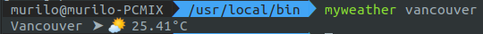

# myweather
Script that return the current weather, using [Open Weather API](https://openweathermap.org/)

## Setup
 - Go to [Open Weather API](https://openweathermap.org/) and generate your API Key. Then paste your Key on ```API_KEY``` variable.
 - Move myweather file to ```/usr/local/bin```
 - Run ```chmod +x myweather```

## Usage
```myweather <city name>```



